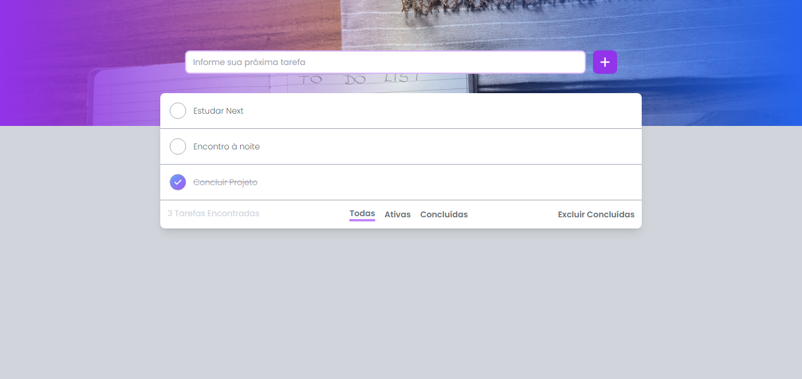

# Quiz
Aplicação To-Do, organize as suas tarefas.



## ✨ Tecnologias
React | Next | TypeScript | TailwindCSS

## 💻 Uso
Em seu terminal:
```bash
# Clone o repositório
git clone https://github.com/ViGF/tarefas.git
# Acesse a pasta do projeto
cd tarefas
# Instale as dependências
yarn add
# Execute a aplicação
yarn run dev
#Agora basta acessar a aplicação
```

<div align="center">
  <small>Desenvolvido por Vitório Gomes - Agosto/2022</small>  
</div>